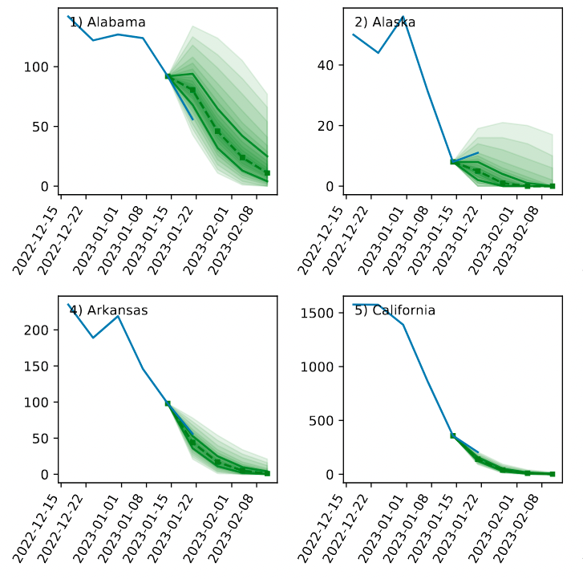

# How to use - Rtrend FluH Forecast

Before using by the first time, it is recommended that you read and execute the steps in the [Setup guide](setup_guide.md).

## Stage 1: activate the virtual environment

This stage is short, but it has to be executed every time a new terminal window is created. It does not need to be executed before every call to `run_forecast_states.py` in the same terminal window.

Open a terminal, then type and run:

````
source ./activate_env.sh
````

Check that now your command line starts with `(rtrend_forecast)` instead of `(base)`, indicating that the environment was successfully activated.

> Note: if the environment fails to load:
> - Make sure that `setup.py` was executed successfully, following the instructions in the [Setup guide](./setup_guide.md).
> 


## Stage 2: run the pre-forecast routine

This stage, if successful, only needs to be executed once at each new week of forecast. It performs the following tasks:

- Update the local project by pulling changes from the remote repository.
- Check for updates in the virtual environment and perform them, if any.
- Downloads the latest truth data from CDC (the past number of hospitalizations).

All these tasks are performed by the `pre_forecast.py` script. In the terminal (with the `rtrend_forecast` environment active), run:

````
python pre_forecast.py
````

And follow the instructions on screen and below.

> Note: your computer must be connected to the internet.

### Step 2.1: Updating the local repository

> If you are running the forecast again after having done this in past weeks, it is likely that the code and parameters have changed. This step will pull the latest code from Github. Mind that locally made changes will be overwritten.

For the next two prompts, type "y" to accept the pull operation and "y" again to discard possible local changes (which may cause a conflict).

### Step 2.2: Checking and updating the virtual environment

> Some new libraries may have been included since the last changes. This step will install these libraries into your local Conda environment.

This step usually requires no interaction. However, if updates are needed, the script will call `conda env update`, which can take anywhere from a few seconds to a few minutes. It can also prompt you to confirm (type "y") the new packages.

### Step 2.3: Updating the truth data from CDC

> Every few days, the CDC updates its GitHub file that contains the past data that is used into the forecast. At some point between Saturday and Monday, they include data from the last week (up to Saturday), which is the one that Rtrend needs to produce up-to-date forecast.

This step requires no interaction. The script will fetch the data from CDC GitHub repo, make a backup from the last file (if needed) then overwrite it with the new data. A warning will be shown if the new data is more than one week old, which probably means that the latest week was not uploaded yet by the CDC.

If all steps above succeed, your code repository should be ready to run the forecast. Otherwise, in case of errors/warnings, follow the instructions from the terminal.

## Stage 3: check past week forecasts

> In this step, we check how we did in the past weeks, given the updated truth data from CDC.

### Step 3.1: Run the code to produce past forecast plots

You will call a script that plots a previous forecast file against new data. In the same terminal with the `rtrend_forecast` environment active, replace the desired date in the following command:

```
python check_forecast_file.py forecast_out/YYYY-MM-DD-CEPH-Rtrend_fluH.csv 
```

Where `YYYY`, `MM` and `DD` should be the year, month and day of the last week's forecast. Autocompletion (pressing 'tab' after `forecast_out/`) may help you with finding the existing files. Usually, you will use _last Monday_ for the past week forecast, the previous Monday for past two weeks forecast, etc.

If the code runs smoothly, you can safely ignore the warning about the target end date not matching the expected one for CDC, as this is a past submission deadline.

> Note: if you can't find the desired forecast file, check that you have updated your local files by Stage 2 running again (press 'y' when prompted).

### Step 3.2: Check the forecast plots

If the past step succeeded, open the project in a finder/explorer window and look for the file `ct_states_reconstructed.pdf` inside the `tmp_figs/` directory. You should see, for each state, the forecast (quantiles and median) overlapping with the latest truth data from CDC, as below:



> You can repeat steps 3.1 and 3.2 with the weeks that you want to check.

## Stage 4: run and tune the current forecast

 The steps of this stage will possibly be performed multiple times, depending on the quality and feedback of the produced forecast.

### Step 4.1: Run the forecast code

In the same terminal with the `rtrend_forecast` environment active, type and run:

````
python run_forecast_states.py
````

A series of messages will be printed on the screen, possibly with some warnings. If the code ends with a "Plots done!" message or similar, the forecast completed without errors, and you can proceed to the next step. Otherwise, an error traceback message should indicate at which point there was an error, and you can inspect the code and project files.

### Step 4.2: Visually inspect the forecasts

If step 4.1 was successful, the code will have produced the following plot files, all within the `tmp_figs/` folder inside the repository:

* `ct_states.pdf` Shows the forecast quantiles and median following the data from the last week. This is the main plot to check.
* `rt_states.pdf` Shows the past reproduction number R(t) estimated by MCMC, as well as the future R(t) projected by the forecast algorithm. Check this file if unreasonable projections are found in ct_states.pdf.
* `interp_states.pdf`, `smooth_states.pdf` or `preproc_states.pdf` Contains the preprocessed input data, combined with the raw truth data for comparison. Allows us to inspect the preprocessing for issues (although we rarely check this file).

Scroll through the `ct_states.pdf` file and evaluate the quality of the forecast. If it looks reasonable for all states, you can proceed to **Stage 5**. Otherwise, check the next step to tune the forecast and improve its quality.

> Note: this script also creates the file `forecast_out/latest.csv`, which contains the forecast data in the format required by the online repository. If needed, check the [Flusight forecast readme](https://github.com/cdcepi/Flusight-forecast-data/blob/master/data-forecasts/README.md#forecasts) or the [COVID-19 forecast readme](https://github.com/reichlab/covid19-forecast-hub/blob/master/data-processed/README.md#forecasts) to understand the formating rules.

### Step 4.3: Tune parameters (if needed)

> Often, especially during the test phase of our method, we may want to tweak the forecast parameters to produce better results for the current data. This shall become less necessary as we understand the data and set criteria to procedurally choose the parameters.

Go to the project main directory and open the file `run_forecast_states.py`, preferably in an IDE or code editor (like Visual Studio Code or PyCharm) for code highlighting. Most of the basic tuning can be done by changing the parameters at the header of the `main()` function. Please check the [Parameter Guide](parameter_guide.md) to find the most relevant parameters and their effect into the forecast method. 

Edit the parameters, save the file and return to step 4.1 to rerun the forecast.  

## Stage 5: check and submit

Once the forecast looks reasonable in the plots, it can be submitted to the online repository as a .csv file. The repository requires strict formatting rules for the data, and the submission will return errors if these rules are not followed. Therefore, it is helpful to check the file before submitting.

### Step 5.1: checking and renaming the forecast csv file

We have a script to run some automated checks in the forecast file; it is the same one used to plot past forecasts in step 3.1. This time, run it as:

```
python check_forecast_file.py forecast_out/latest.csv -r 
```

This time, include the `-r` flag in the end; this copies and renames the `latest.csv` forecast file with the required name for submission, including the CEPH-Rtrend team/model name and the current forecast date.

If the code runs without finding issues in the data, a message in green text will be shown in the end, and the data is (probably, see note below) ready to submit. Otherwise, yellow text messages will warn about data formatting issues. In this case, inspect the file, look for a solution to the issue and rerun the command above. As usual, it is possible that the code aborts due to an error, in which case an error traceback will be printed.

> Note: not all potential data formatting errors are covered by the `check_forecast_file.py` script, so errors in the submission may still occur.

> Note: you can also visually inspect the forecast plots in `tmp_figs/ct_states_reconstructed.pdf`. This should be similar to ct_states.pdf, but reconstructed directly from the forecast file just to cross-check that it was exported correctly.


### Step 5.2: submission to the online repository 

Once the forecast was executed and checked without warnings, you are ready to submit the forecast .csv file to the corresponding online repository on GitHub. This can be done from a browser via GitHub, or using git or the GitHub Desktop app locally.

For submissions on behalf of the CEPH Lab team, you can follow this [Forecast Submission Guide](./submission_guide.md). Make sure that you are logged in to a GitHub account that has access to the following fork repositories:  

* Flusight forecast repository (CEPH fork): [https://github.com/paulocv/Flusight-forecast-data](https://github.com/paulocv/Flusight-forecast-data)

* COVID-19 forecast repository (CEPH fork): [https://github.com/paulocv/covid19-forecast-hub](https://github.com/paulocv/covid19-forecast-hub)


